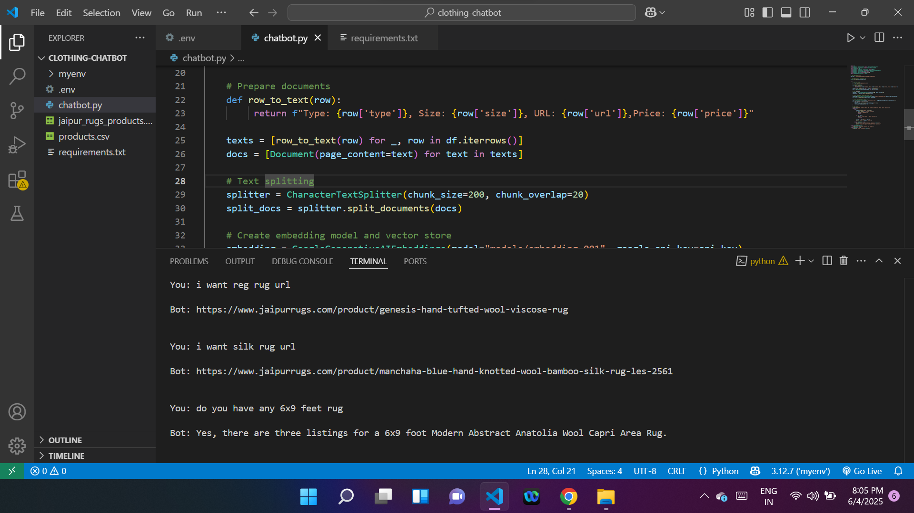

# CHATBOT_AI_AGENT

# 🧠 Chatbot AI Agent for E-commerce Product Search

This AI-powered chatbot enables users to search and explore product information (such as rugs or clothing) from a CSV file using natural language. It uses **LangChain**, **Gemini embeddings**, **FAISS** vector search, and a simple frontend interface (Streamlit).

## 🖼️ Demo



> _This image shows the chatbot answering queries about e-commerce products._

---

## 🚀 Quick Start Guide

Follow the steps below to get your Chatbot AI Agent running locally:

---

```bash
git clone https://github.com/yourusername/chatbot-ai-agent.git
cd chatbot-ai-agent

------
### ✅ Step 2: CREATE VIRTUAL ENVIROMENT

python -m venv myenv
myenv\Scripts\activate

----------

### ✅ Step 3: Install Required Packages
pip install -r requirements.txt

------------

🔑 Step 4: Set Up Your API Key
GOOGLE_API_KEY=your_gemini_api_key_here

--------------

📁 Step 5: Add Your CSV Product Data
agent = RugSearchAgent("data/products.csv")

--------------
💬 Step 6: Run the Chatbot
python runagent.py


